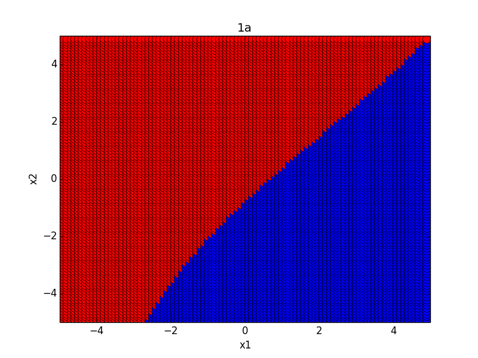
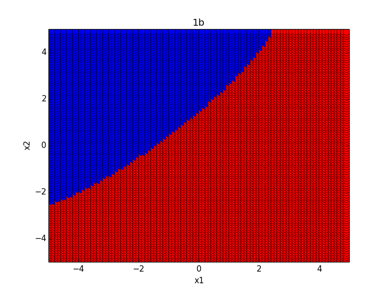
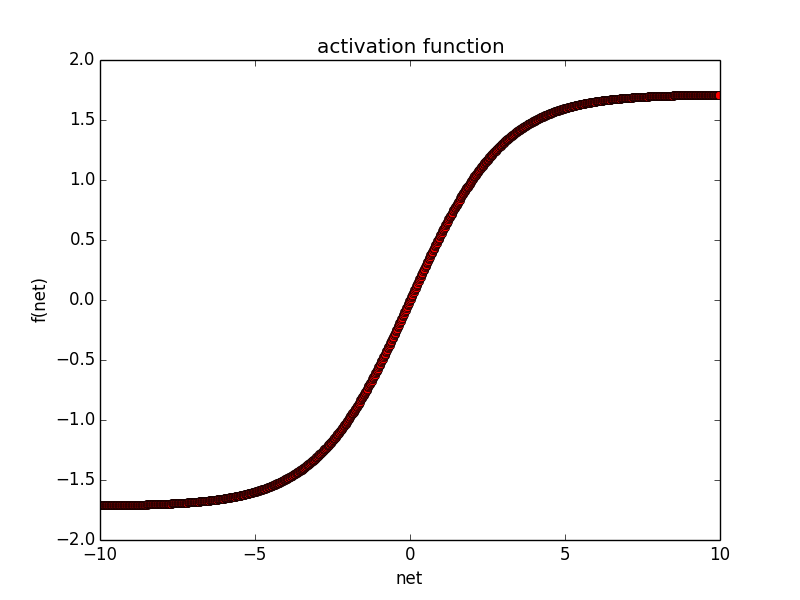
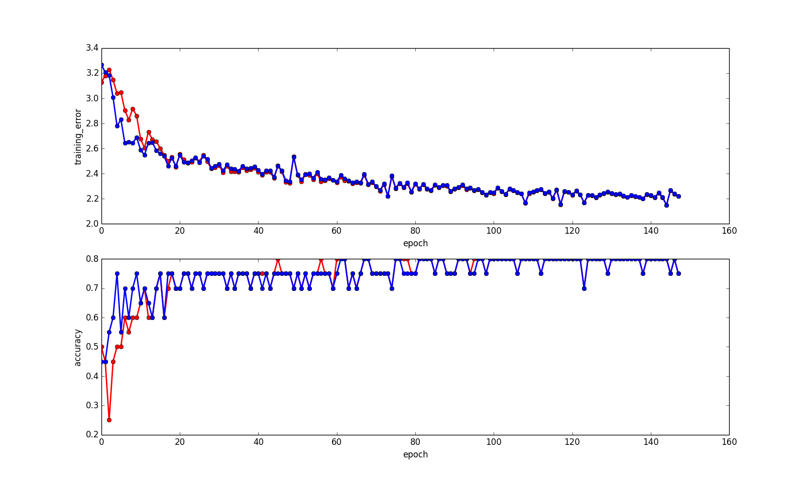
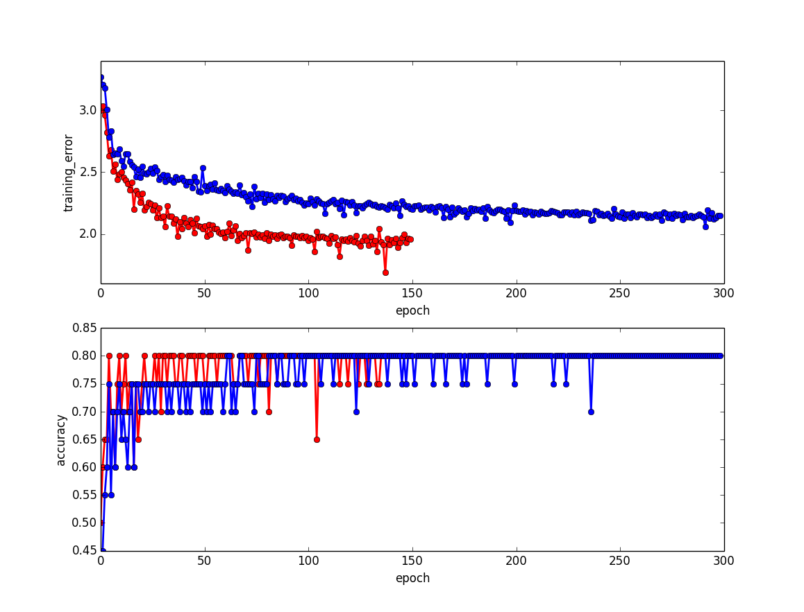
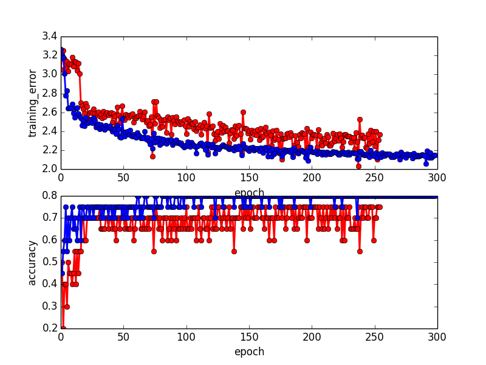

# A simple neural network

This is a simple neural network without using deep learning and gradient descent libraries.

## How to run

```shell
python main.py
```

## Some Results













## Instructions

For the implementations details, please refer to [solution.pdf](./doc/solution.pdf).

## Acknowledgement

If this repo helps you, please **star** it!

Thank you!